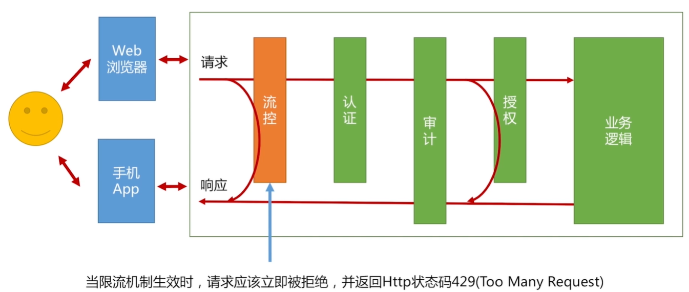

## 1、什么是流控

​		所谓流控，就是流量控制，也称作限流。只放系统能够处理的请求数量过去。

## 2、为什么要做流控

​		保证系统的可用性，防止大流量把系统压死。如果系统不可用。其实做什么都没有意义了。还以用作安全目的，比如可以减慢暴力密码破解的速率。还可以用来抵御DDOS攻击。

## 3、流控为什么要在整个安全机制链路的第一关

​		因为认证、审计，授权都是需要消耗系统资源的。能够越早把一些请求拒绝掉，资源的浪费就会越少。就能处理更多的请求。所以流控应该是在整个安全机制的最前面。且就算后面的安全机制做的再好，服务器被大流量压死了，服务不可用也没用了。

​		

## 4、流控可以在什么地方做

​		4.1、在负载均衡、反向代理上做，一般是针对整个集群来做的。比如说在nginx上，和网关上（zuul）等。

​		4.2、在自己的应用中，针对单个应用节点。

可以的话，在两端都进行配置。

​		nginx上做流控限制：<https://www.nginx.com/blog/rate-limiting-nginx/>

## 5、使用Guava做简单的流量控制

​		5.1、导入guava依赖

​		5.2、编写过滤器

​		当然在实际的开发中，我们所要面对的流控的场景是非常复杂的，不是简单的设个数就完了。比如说会根据用户来限流，可能需要把更多的资源留给vip用户，那么vip用户可能是每秒500请求，普通用户可能是每秒50请求。这样的话，当大量的请求过来之后，vip用户能正常使用网站，普通用户可能会有很多请求就被拒绝掉了。

​		Guava的RateLimiter类参考文档：<http://ifeve.com/guava-ratelimiter/>

​		

​		

