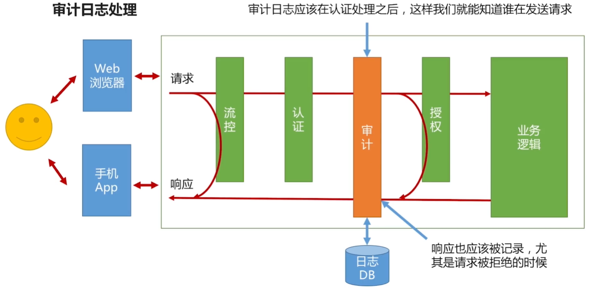
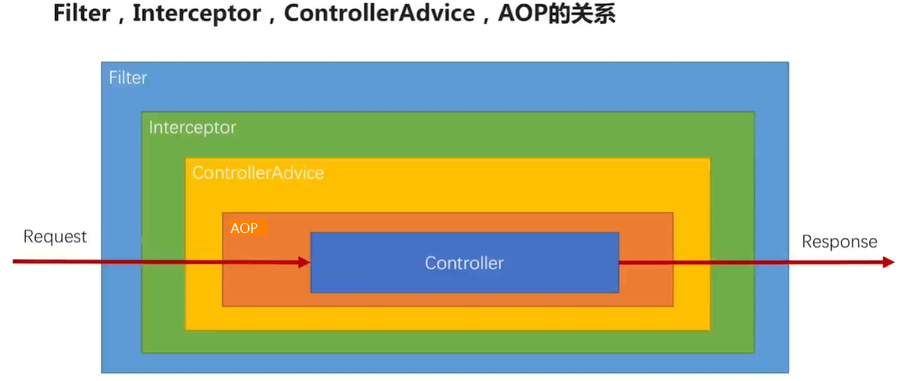

## 1、审计所在安全链路的位置，为什么

​		如图所示，审计应该做在认证之后，授权之前。因为只有在认证之后，我们在记录日志的时候，在知道请求是那个用户发过来的；做在授权之前，哪些请求被拒绝了，在响应的时候，也可以把它记录下来。如果放到授权之后 ，那么被拒绝的请求就不能记录了。

​		审计日志一定要持久化，方便我们对问题的追溯，可以把它放到数据库中，也可以写到磁盘中。实际工作中，一般会发送到公司统一的日志服务上，由日志服务来存储。

## 2、审计采用的组件，及安全链路顺序的保障

​		首先，我们来明确一下各组件在请求中的执行顺序，如下图，依次是 Filter -> Interceptor -> ControllerAdvice -> AOP -> Controller

​		对于Filter之间，我们可以使用@Order注解来确定执行顺序；对于Interceptor之间根据注册的先后顺序执行。

​		这里我们的审计功能选择Filter和Interceptor都可以，根据自己的喜好即可。

## 3、实现审计功能

​		3.1、审计类准备

​		3.2、配置JPA审计功能

​		3.3、通过Filter或Interceptor实现审计功能

