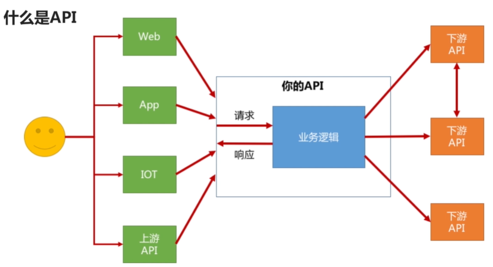
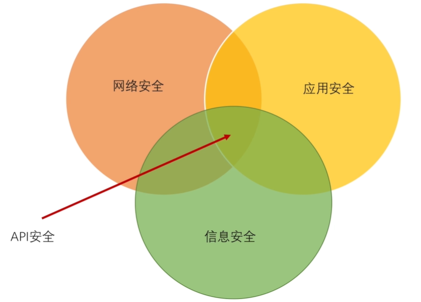

## 1、什么是API?

百度百科给出的定义如下：

​		API（Application Programming Interface，应用程序接口）是一些预先定义的函数，或指软件系统不同组成部分衔接的约定。 目的是提供应用程序与开发人员基于某软件或硬件得以访问一组例程的能力，而又无需访问原码，或理解内部工作机制的细节。

​		通俗的来理解就是提供给用户服务的一种方式，对于我们Java后台开发人员来说，就是我们给前端或者其他项目提供的接口，供他们进行使用。如果API出了问题，那么就不能为用户提供服务了。

## 2、API安全包含几方面的内容？

主要包含三方面内容：信息安全、网络安全、应用安全。

​		信息安全：所有的信息，在它的整个生命周期里（创建-存储-转换-销毁等）应该是受到保护的。（比如使用访问控制技术，加密解密技术等来保证信息是安全）

​		网络安全：数据在进行网络传输的过程中，是安全的。不会被人盗取、串改。不会被未授权的访问接触到不应该接触的信息。（比如使用 防火墙，负载均衡器，反向代理等，https等来保证网络安全）

​		应用安全：程序的设计上如何抵挡各种各样的攻击。（开发测试时需要注意的问题，如何存储管理用户信息，如何校验）

这三个方面综合起来，可以说我们的API是安全的。

## 3、API安全的目标

​		机密性（Confientiality）：确保信息只被预期的读者访问。

​		完整性（Integrity）：防止未授权的创建，修改和删除。

​		可用性（Availability）：当用户需要访问API时，API总是可用的。

## 4、常见的API风险

​	欺骗（Spoofing）：伪装成某人。

​	干预（Tampering）：将不希望被修改的数据、消息或设置改掉。

​	否认（Repudiation）：拒绝承认做过某事。

​	信息泄漏（Information disclosure）：将你希望保密的信息披露出来。

​	拒绝服务（Denial of service）：阻止用户访问信息和服务。

​	越权（Elevation of privilege）：做了你不希望他能做的事。

## 5、解决API风险的安全机制

​	认证：（欺骗），确保你的用户或客户端真的是他们自己。

​	授权：（信息泄漏、干预、越权），确保每个针对API的访问都是经过授权的。

​	审计：（否认），确保所有的操作都被记录，以便追溯和监控。

​	流控：（拒绝服务），防止用户请求淹没API。

​	加密：（信息泄漏），确保出入API的数据都是私密的。

​		结合上面的图，我们可以更好的理解安全机制，最右面的是我们提供的API，最左边是用户，在这之间就需要我们加入安全机制。首先加密是贯穿在整个安全机制流程种的；然后是流控，可以把一些不必要的请求拦截掉，不用走后面的流程；接下来是认证，来确保用户的身份；然后是审计，将用户做了什么记录下来；最后是授权，来决定请求是否可以被执行。

​		

​		

