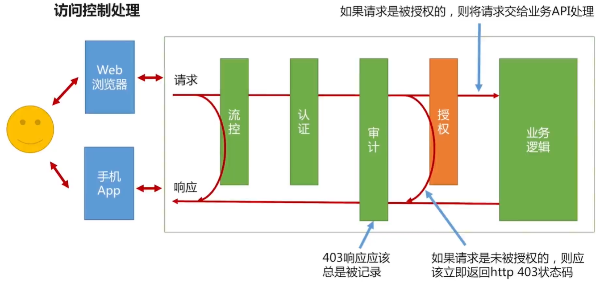

## 1、授权

​		授权在整个安全机制中，是比较重要的一环，一般要考虑两个事情，一个是访问的请求需不需要身份认证，如果不需要直接放过，如果需要，但是没有认证，应该返回401,需要用户进行认证。另一个就是，认证了，看有没有该资源的访问权限，如果有，放行；如果没有返回403，无权限。

## 2、常见的访问控制

​	2.1、ACL ：Access Control Lists，简单易用，容易实现。常见读写等少量权限控制。

​	2.2、RBAC：Role Based Access Control。引入角色，方便管理权限。开发交ACL复杂。

## 3、使用ACL实现授权控制

​		这里我们实现一个简单的ACL权限控制，要求，所有的请求都必须经过认证，可以为用户授予读写权限，读权限可以访问GET请求，其他请求需要有写权限。

​		3.1、在用户实体中添加权限字段

​		3.2、使用Filter进行授权控制，要求审计模块也是用Filter实现的