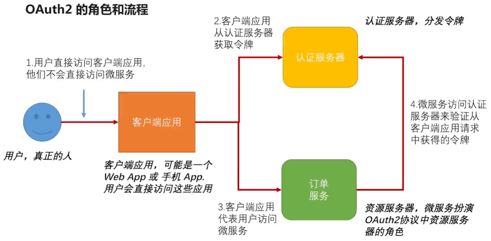

## 1、OAuth2协议中的角色流程概要介绍

​		OAuth2协议主要使用来认证和授权的，我们先来看一下OAuth2协议中的角色

​	1.1、用户：真正的人，大家都有可能是某一个服务的用户。

​	1.2、客户端应用：Web或手机App，直接跟用户打交道的。通过客户端应用发http请求，访问服务。

​	1.3、认证服务器：作用就是认证，验证用户身份发出令牌。

​	1.4、资源服务器：在这里代表各个微服务。一个认证服务器可以对应多个资源服务器。

​	大概的流程是：用户直接访问客户端应用，客户端首先要去认证服务器认证，验证要访问微服务用户的真实性，认证服务器确认用户身份后，会发出一个代表用户身份的令牌给客户端应用，客户端应用就会拿着令牌去访问资源服务器（我们的微服务），资源服务器会去认证服务器验证这个令牌是谁。

## 2、部分角色准备

​	2.1、用户，就是我们自己。

​	2.2、客户端应用：http请求工具，可以是Restlet Client、Postman等。

​	2.3、资源服务器，我们准备两个简单的微服务，一个订单服务，一个价格服务，订单服务调用价格服务获取价格。

## 3、搭建认证服务器

​	3.1、导入spring-cloud-starter-oauth2依赖

​	3.2、编写授权服务器配置类，继承AuthorizationServerConfigurerAdapter，添加@EnableAuthorizationServer注解

​	3.3、配置安全配置类，继承WebSecurityConfigurerAdapter，添加@EnableWebSecurity注解

​	3.5、/oauth/token获取token，/oauth/token_key，/oauth/check_token用于校验token

